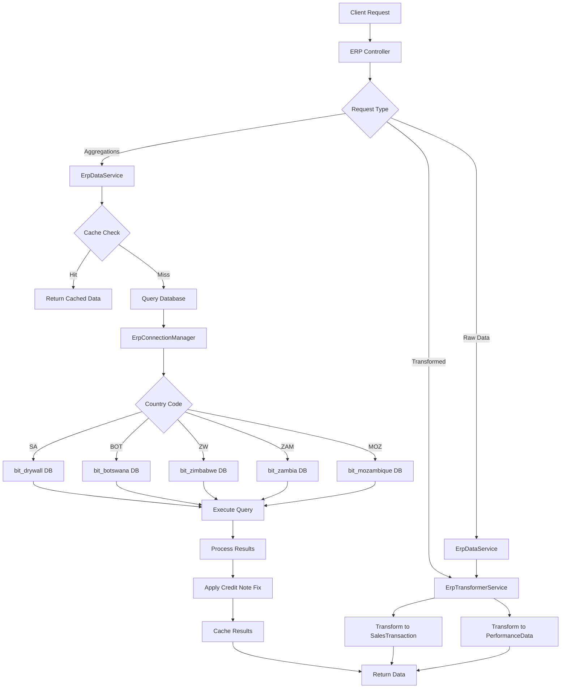
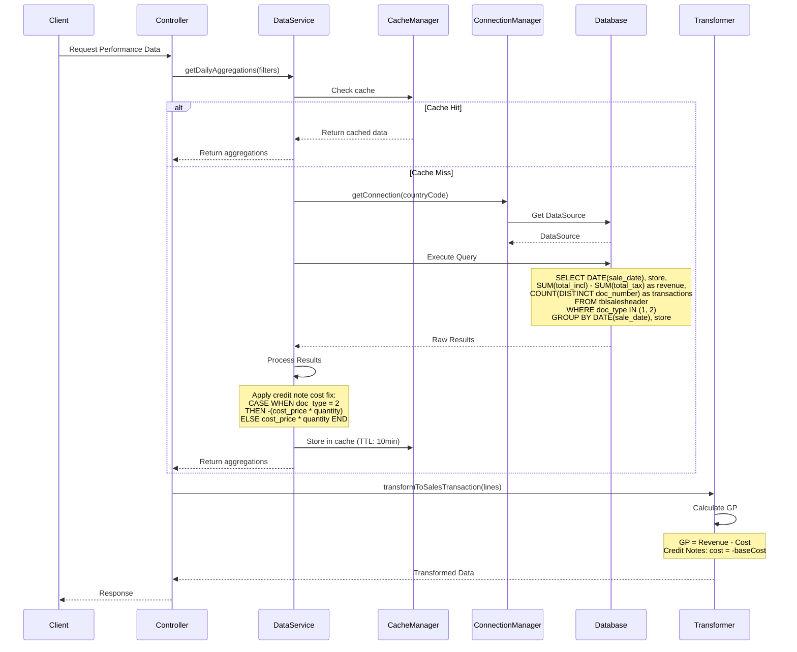
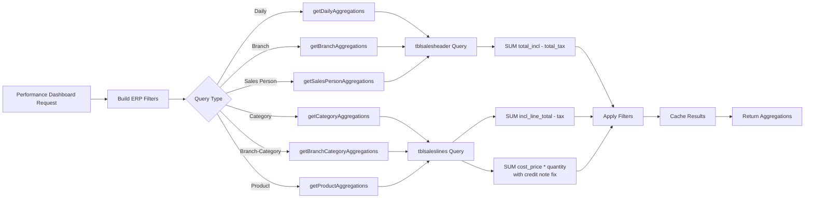
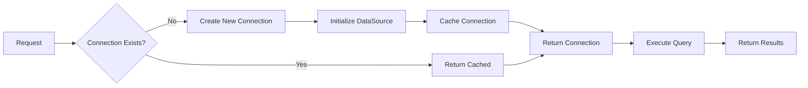

# ERP Module Documentation

## Overview

The ERP module provides a comprehensive interface to the ERP database system, handling sales data queries, aggregations, transformations, and caching. It supports multi-country operations (SA, BOT, ZW, ZAM, MOZ) with separate database connections per country.

## Architecture

### Core Services

1. **ErpDataService** - Main data access layer with query execution, caching, and circuit breaker patterns
2. **ErpTransformerService** - Transforms raw ERP entities into application-friendly formats
3. **ErpConnectionManagerService** - Manages multi-country database connections
4. **ErpCacheWarmerService** - Pre-warms cache for common date ranges
5. **ErpTargetsService** - Handles sales target calculations

### Key Features

- ✅ **Multi-Country Support**: Separate database connections per country (SA, BOT, ZW, ZAM, MOZ)
- ✅ **Aggressive Caching**: 10-minute TTL with intelligent cache warming
- ✅ **Circuit Breaker Pattern**: Prevents cascading failures
- ✅ **Sequential Query Execution**: Prevents connection pool exhaustion
- ✅ **Credit Note Handling**: Properly handles negative revenue and cost
- ✅ **Customer Category Filtering**: Support for include/exclude category filters
- ✅ **Date Range Chunking**: Automatic chunking for large date ranges (>60 days)

## Document Types

The ERP system uses different document types to represent various transaction states:

| Doc Type | Name | Description | Revenue Impact |
|----------|------|-------------|----------------|
| 1 | Tax Invoice | Completed sales transaction | ✅ Positive |
| 2 | Credit Note | Returns/refunds | ❌ Negative (reduces revenue) |
| 3 | Quotation | Price quote (potential sale) | ⚠️ Not included in revenue |
| 4 | Sales Order | Confirmed order (not invoiced) | ⚠️ Not included in revenue |

**Critical**: Credit Notes (doc_type = 2) have **negative revenue** and must also have **negative cost** to maintain correct GP calculations.

## Data Flow

### High-Level Data Flow



### Detailed Query Flow



### Aggregation Query Flow



## Query Reference

### Raw Data Queries

#### 1. Get Sales Headers
**Method**: `getSalesHeadersByDateRange(filters, countryCode)`

**Query**:
```sql
SELECT * FROM tblsalesheader
WHERE sale_date BETWEEN :startDate AND :endDate
  AND doc_type = 1  -- Tax Invoices only
  AND sale_date >= '2020-01-01'
```

**Filters Applied**:
- Store code (`store`)
- Sales person (`sales_code`)
- Customer categories (include/exclude via EXISTS)

**Returns**: `TblSalesHeader[]`

---

#### 2. Get Sales Lines
**Method**: `getSalesLinesByDateRange(filters, includeDocTypes, countryCode)`

**Query**:
```sql
SELECT * FROM tblsaleslines
WHERE sale_date BETWEEN :startDate AND :endDate
  AND doc_type IN (:docTypes)  -- Default: ['1'] (Tax Invoices)
  AND item_code IS NOT NULL
  AND sale_date >= '2020-01-01'
  AND type = 'I'  -- Inventory items only
```

**Filters Applied**:
- Store code (`store`)
- Category (`category`)
- Sales person (`rep_code`)
- Customer categories (include/exclude via EXISTS)

**Returns**: `TblSalesLines[]`

---

### Aggregation Queries

#### 3. Daily Aggregations
**Method**: `getDailyAggregations(filters, countryCode)`

**Query**:
```sql
SELECT 
  DATE(header.sale_date) as date,
  header.store as store,
  SUM(header.total_incl) - SUM(header.total_tax) as totalRevenue,
  CAST(0 AS DECIMAL(19,2)) as totalCost,  -- Not available in header table
  COUNT(DISTINCT header.doc_number) as transactionCount,
  COUNT(DISTINCT header.customer) as uniqueCustomers,
  0 as totalQuantity
FROM tblsalesheader header
WHERE header.sale_date BETWEEN :startDate AND :endDate
  AND header.doc_type IN (1, 2)  -- Tax Invoices AND Credit Notes
  AND header.sale_date >= '2020-01-01'
GROUP BY DATE(header.sale_date), header.store
ORDER BY DATE(header.sale_date) ASC
```

**Returns**: `DailyAggregation[]`

**Note**: Cost is set to 0 as it's not available in header table. Cost must be calculated from sales lines separately.

---

#### 4. Branch Aggregations
**Method**: `getBranchAggregations(filters, countryCode)`

**Query**:
```sql
SELECT 
  header.store as store,
  SUM(header.total_incl) - SUM(header.total_tax) as totalRevenue,
  CAST(0 AS DECIMAL(19,2)) as totalCost,  -- Not available in header table
  COUNT(DISTINCT header.doc_number) as transactionCount,
  COUNT(DISTINCT header.customer) as uniqueCustomers,
  0 as totalQuantity
FROM tblsalesheader header
WHERE header.sale_date BETWEEN :startDate AND :endDate
  AND header.doc_type IN (1, 2)  -- Tax Invoices AND Credit Notes
  AND header.sale_date >= '2020-01-01'
GROUP BY header.store
ORDER BY totalRevenue DESC
```

**Returns**: `BranchAggregation[]`

---

#### 5. Category Aggregations
**Method**: `getCategoryAggregations(filters, countryCode)`

**Query**:
```sql
SELECT 
  line.category as category,
  SUM(line.incl_line_total) - SUM(line.tax) as totalRevenue,
  SUM(CASE 
    WHEN line.doc_type = 2 THEN -(line.cost_price * line.quantity)
    ELSE line.cost_price * line.quantity
  END) as totalCost,  -- ✅ Credit notes have negative cost
  SUM(line.quantity) as totalQuantity
FROM tblsaleslines line
WHERE line.sale_date BETWEEN :startDate AND :endDate
  AND line.doc_type IN ('1', '2')  -- Tax Invoices AND Credit Notes
  AND line.item_code NOT IN ('.')
  AND line.type = 'I'  -- Inventory items only
  AND line.sale_date >= '2020-01-01'
GROUP BY line.category
```

**Returns**: `CategoryAggregation[]`

**Critical Fix**: Credit notes (doc_type = 2) have **negative cost** to match negative revenue.

---

#### 6. Branch-Category Aggregations
**Method**: `getBranchCategoryAggregations(filters, countryCode)`

**Query**:
```sql
SELECT 
  line.store as store,
  line.category as category,
  SUM(line.incl_line_total) - SUM(line.tax) as totalRevenue,
  SUM(CASE 
    WHEN line.doc_type = 2 THEN -(line.cost_price * line.quantity)
    ELSE line.cost_price * line.quantity
  END) as totalCost,  -- ✅ Credit notes have negative cost
  COUNT(DISTINCT line.doc_number) as transactionCount,
  COUNT(DISTINCT line.customer) as uniqueCustomers,
  SUM(line.quantity) as totalQuantity
FROM tblsaleslines line
WHERE line.sale_date BETWEEN :startDate AND :endDate
  AND line.doc_type IN ('1', '2')  -- Tax Invoices AND Credit Notes
  AND line.item_code IS NOT NULL
  AND line.item_code != '.'
  AND line.type = 'I'  -- Inventory items only
  AND line.sale_date >= '2020-01-01'
GROUP BY line.store, line.category
ORDER BY totalRevenue DESC
```

**Returns**: `BranchCategoryAggregation[]`

---

#### 7. Sales Person Aggregations
**Method**: `getSalesPersonAggregations(filters, countryCode)`

**Query**:
```sql
SELECT 
  line.rep_code as salesCode,
  salesman.Description as salesName,
  SUM(line.incl_line_total - line.tax) as totalRevenue,
  CAST(0 AS DECIMAL(19,2)) as totalCost,  -- Cost not available
  COUNT(DISTINCT line.doc_number) as transactionCount,
  COUNT(DISTINCT line.customer) as uniqueCustomers,
  SUM(line.quantity) as totalQuantity
FROM tblsaleslines line
LEFT JOIN tblsalesman salesman ON line.rep_code = salesman.Code
WHERE line.sale_date BETWEEN :startDate AND :endDate
  AND line.doc_type IN ('1', '2')  -- Tax Invoices AND Credit Notes
  AND line.type = 'I'  -- Inventory items only
  AND line.sale_date >= '2020-01-01'
  AND line.rep_code IS NOT NULL
  AND line.rep_code != ''
  AND line.item_code IS NOT NULL
GROUP BY line.rep_code
ORDER BY totalRevenue DESC
```

**Returns**: `SalesPersonAggregation[]`

---

#### 8. Product Aggregations
**Method**: `getProductAggregations(filters, limit, countryCode)`

**Query**:
```sql
SELECT 
  line.item_code as itemCode,
  line.description as description,
  line.category as category,
  SUM(line.incl_line_total) - SUM(line.tax) as totalRevenue,
  SUM(CASE 
    WHEN line.doc_type = 2 THEN -(line.cost_price * line.quantity)
    ELSE line.cost_price * line.quantity
  END) as totalCost,  -- ✅ Credit notes have negative cost
  SUM(line.quantity) as totalQuantity,
  COUNT(DISTINCT line.doc_number) as transactionCount
FROM tblsaleslines line
WHERE line.sale_date BETWEEN :startDate AND :endDate
  AND line.doc_type IN ('1', '2')  -- Tax Invoices AND Credit Notes
  AND line.item_code IS NOT NULL
  AND line.item_code != '.'  -- Exclude '.' item codes
  AND line.type = 'I'  -- Inventory items only
  AND line.sale_date >= '2020-01-01'
GROUP BY line.description
ORDER BY totalRevenue DESC
LIMIT :limit
```

**Returns**: `ProductAggregation[]`

---

### Specialized Queries

#### 9. Hourly Sales Pattern
**Method**: `getHourlySalesPattern(filters, countryCode)`

**Query**:
```sql
SELECT 
  HOUR(header.sale_time) as hour,
  COUNT(DISTINCT header.doc_number) as transactionCount,
  CAST(SUM(CAST(header.total_incl AS DECIMAL(19,3))) - 
       SUM(CAST(header.total_tax AS DECIMAL(19,3))) AS DECIMAL(19,2)) as totalRevenue,
  COUNT(DISTINCT header.customer) as uniqueCustomers
FROM tblsalesheader header
WHERE header.sale_date BETWEEN :startDate AND :endDate
  AND header.doc_type IN (1, 2)  -- Tax Invoices AND Credit Notes
  AND header.sale_time IS NOT NULL
  AND header.sale_date >= '2020-01-01'
GROUP BY HOUR(header.sale_time)
ORDER BY HOUR(header.sale_date) ASC
```

**Returns**: `Array<{hour: number, transactionCount: number, totalRevenue: number, uniqueCustomers: number}>`

---

#### 10. Payment Type Aggregations
**Method**: `getPaymentTypeAggregations(filters, countryCode)`

**Query**:
```sql
SELECT 
  CAST(SUM(CAST(header.total_incl AS DECIMAL(19,3))) - 
       SUM(CAST(header.total_tax AS DECIMAL(19,3))) AS DECIMAL(19,2)) as taxExcludedTotal,
  CAST(SUM(CAST(header.cash AS DECIMAL(19,3))) - 
       SUM(CAST(header.change_amnt AS DECIMAL(19,3))) AS DECIMAL(19,2)) as cash,
  CAST(SUM(CAST(header.credit_card AS DECIMAL(19,3))) AS DECIMAL(19,2)) as credit_card,
  CAST(SUM(CAST(header.eft AS DECIMAL(19,3))) AS DECIMAL(19,2)) as eft,
  -- ... other payment methods
  COUNT(*) as totalTransactions
FROM tblsalesheader header
WHERE header.sale_date BETWEEN :startDate AND :endDate
  AND header.doc_type IN (1, 2)  -- Tax Invoices AND Credit Notes
  AND header.sale_date >= '2020-01-01'
```

**Returns**: Payment methods scaled proportionally to tax-excluded total

---

#### 11. Conversion Rate Data
**Method**: `getConversionRateData(filters, countryCode)`

**Queries**:
```sql
-- Quotations (doc_type = 3)
SELECT 
  COUNT(*) as totalQuotations,
  CAST(SUM(CAST(header.total_incl AS DECIMAL(19,3))) AS DECIMAL(19,2)) as totalQuotationValue
FROM tblsalesheader header
WHERE header.sale_date BETWEEN :startDate AND :endDate
  AND header.doc_type = 3  -- Quotations
  AND header.sale_date >= '2020-01-01'

-- Converted Invoices (doc_type = 1 with invoice_used = 1)
SELECT 
  COUNT(*) as convertedInvoices,
  CAST(SUM(CAST(header.total_incl AS DECIMAL(19,3))) AS DECIMAL(19,2)) as convertedInvoiceValue
FROM tblsalesheader header
WHERE header.sale_date BETWEEN :startDate AND :endDate
  AND header.doc_type = 1  -- Tax Invoices
  AND header.invoice_used = 1  -- Converted from quotation
  AND header.sale_date >= '2020-01-01'
```

**Returns**: `{totalQuotations, totalQuotationValue, convertedInvoices, convertedInvoiceValue, conversionRate}`

---

## Gross Profit (GP) Calculations

### Formula

```
GP = Revenue - Cost
GP% = (GP / Revenue) × 100  (if revenue > 0)
```

### Revenue Calculation

**From tblsalesheader**:
```sql
SUM(total_incl) - SUM(total_tax)
```

**From tblsaleslines**:
```sql
SUM(incl_line_total) - SUM(tax)
```

Both formulas exclude tax and include credit notes (which have negative values).

### Cost Calculation

**Critical Fix Applied**: Credit notes must have negative cost to match negative revenue.

**SQL Aggregations**:
```sql
SUM(CASE 
  WHEN doc_type = 2 THEN -(cost_price * quantity)
  ELSE cost_price * quantity
END) as totalCost
```

**TypeScript Transformations**:
```typescript
const baseCost = cost_price * quantity;
const cost = doc_type === 2 ? -baseCost : baseCost;
```

### Why Credit Notes Need Negative Cost

Credit notes represent returns/refunds:
- **Revenue Impact**: Negative (reduces total revenue)
- **Cost Impact**: Should also be negative (reduces total cost)
- **GP Impact**: `GP = (Sales Revenue - Credit Revenue) - (Sales Cost - Credit Cost)`

**Example**:
```
Sales: Revenue = R1000, Cost = R600, GP = R400
Credit Note: Revenue = -R200, Cost = -R150, GP = -R50

Net: Revenue = R800, Cost = R450, GP = R350 ✅
```

Without the fix:
```
Net: Revenue = R800, Cost = R750, GP = R50 ❌ (incorrect)
```

## Caching Strategy

### Cache TTL
- **Default**: 10 minutes (600 seconds)
- **Today's Data**: Refreshed every 5 minutes
- **Full Cache Warm**: Every 10 minutes

### Cache Keys
Format: `erp:v2:{countryCode}:{dataType}:{startDate}:{endDate}:{storeCode}:{category}:{salesPerson}:{docTypes}:{customerCategoryFilters}`

### Cache Warming
**Common Date Ranges**:
- Today
- Last 7 Days
- Last 30 Days
- Today to 1 Month Back

**Query Groups**:
- **Group A** (Parallel): Aggregations, Hourly Sales, Payment Types, Conversion Rate
- **Group B** (Parallel): Master Data, Sales Lines, Sales Headers

### Cache Bypass
Cache is bypassed when:
- Exclusion filters (`excludeCustomerCategories`) are present
- Manual cache clear is requested

## Connection Management

### Multi-Country Support

| Country Code | Database Name |
|--------------|---------------|
| SA | bit_drywall |
| BOT | bit_botswana |
| ZW | bit_zimbabwe |
| ZAM | bit_zambia |
| MOZ | bit_mozambique |

### Connection Pool Settings
- **Connection Limit**: 75 (configurable via `ERP_DB_CONNECTION_LIMIT`)
- **Connect Timeout**: 10 seconds
- **Acquire Timeout**: 30 seconds
- **Query Timeout**: 90 seconds (adaptive based on date range)
- **Idle Timeout**: 600 seconds

### Connection Lifecycle



## Error Handling

### Circuit Breaker Pattern

**States**:
- **CLOSED**: Normal operation
- **OPEN**: Circuit opened after 5 consecutive failures
- **HALF_OPEN**: Testing recovery after 60 seconds

**Failure Thresholds**:
- **Network Errors**: 5 failures
- **SQL Errors**: 10 failures
- **Total Failures**: 5 failures

**Recovery**:
- Auto-recovery after 60 seconds
- Allows 2 test requests in HALF_OPEN state

### Retry Logic

**Retry Strategy**:
- **Network Errors**: Up to 5 retries with exponential backoff
- **SQL Errors**: Up to 1 retry (likely permanent)
- **Default**: Up to 3 retries

**Backoff**: 1s → 2s → 4s (with jitter)

## Performance Optimizations

### Date Range Chunking
- **Threshold**: >60 days
- **Chunk Size**: 30 days per chunk
- **Execution**: Sequential processing

### Query Concurrency
- **Max Concurrent Queries**: 3
- **Execution**: Sequential (one query at a time)
- **Request Queuing**: Automatic for overflow

### Pre-Filtering
- Customer category filters applied via EXISTS (prevents row multiplication)
- Pre-grouped data caching for fast in-memory filtering

## Data Transformation

### Sales Transaction Transformation

**Input**: `TblSalesLines` entity
**Output**: `SalesTransaction` interface

**Calculations**:
```typescript
revenue = incl_line_total
cost = doc_type === 2 ? -(cost_price * quantity) : (cost_price * quantity)
grossProfit = revenue - cost
grossProfitPercentage = revenue > 0 ? (grossProfit / revenue) * 100 : 0
```

### Performance Data Transformation

**Input**: `TblSalesLines` + `TblSalesHeader` entities
**Output**: `PerformanceData` interface

**Key Fields**:
- `salesPersonId`: From `header.sales_code` (preferred) or `line.rep_code`
- `revenue`: From `line.incl_line_total`
- `target`: Set to 0 (calculated at daily/period level)

## Filtering Options

### ErpQueryFilters Interface

```typescript
interface ErpQueryFilters {
  startDate: string;           // YYYY-MM-DD
  endDate: string;             // YYYY-MM-DD
  storeCode?: string;          // Store code filter
  category?: string;           // Product category filter
  salesPersonId?: string | string[];  // Sales person code(s)
  includeCustomerCategories?: string[];  // Include only these categories
  excludeCustomerCategories?: string[];  // Exclude these categories
}
```

### Customer Category Filtering

**Include Filter**:
```sql
EXISTS (
  SELECT 1 FROM tblcustomers customer 
  WHERE customer.Code = header.customer 
  AND customer.Category IN (:...includeCustomerCategories)
)
```

**Exclude Filter**:
```sql
(header.customer IS NULL OR NOT EXISTS (
  SELECT 1 FROM tblcustomers customer 
  WHERE customer.Code = header.customer 
  AND customer.Category IN (:...excludeCustomerCategories)
))
```

## Database Tables

### Primary Tables

1. **tblsalesheader**
   - Document-level sales data
   - Fields: `doc_number`, `sale_date`, `sale_time`, `store`, `customer`, `sales_code`, `total_incl`, `total_tax`, `doc_type`
   - Used for: Daily/Branch aggregations, payment types, hourly patterns

2. **tblsaleslines**
   - Line-item sales data
   - Fields: `ID`, `doc_number`, `sale_date`, `store`, `category`, `item_code`, `description`, `quantity`, `incl_price`, `incl_line_total`, `cost_price`, `tax`, `rep_code`, `customer`, `doc_type`, `type`
   - Used for: Category/Product aggregations, GP calculations

3. **tblcustomers**
   - Customer master data
   - Fields: `Code`, `Category`
   - Used for: Customer category filtering

4. **tblcustomercategories**
   - Customer category definitions
   - Fields: `cust_cat_code`, `cust_cat_description`
   - Used for: Category name lookups

5. **tblsalesman**
   - Sales person master data
   - Fields: `Code`, `Description`
   - Used for: Sales person name lookups

6. **tblmultistore**
   - Store/Branch master data
   - Fields: `code`, `description`, `alias`
   - Used for: Branch name lookups

7. **tblforex-history**
   - Exchange rate history (in consolidated database)
   - Used for: Multi-currency conversions

## API Endpoints

### Health & Monitoring
- `GET /erp/health` - Health check
- `GET /erp/stats` - Statistics
- `GET /erp/connection-pool-info` - Connection pool status
- `GET /erp/connection-health` - Connection health

### Cache Management
- `POST /erp/cache/warm` - Warm cache
- `POST /erp/cache/refresh` - Refresh cache
- `DELETE /erp/cache` - Clear cache
- `GET /erp/cache/stats` - Cache statistics
- `GET /erp/cache/health` - Cache health check

### Data Endpoints
- `GET /erp/profile/sales` - Profile sales data
- `GET /erp/users/:userId/sales` - User sales data
- `GET /erp/users/:userId/commissions-by-category` - User commissions
- `GET /erp/profile/commissions` - Profile commissions
- `GET /erp/profile/sales-by-category` - Sales by category
- `GET /erp/team/targets` - Team targets
- `GET /erp/profile/commissions-by-category` - Profile commissions by category

## Testing

### Unit Tests
- `erp-transformer.service.spec.ts` - Transformer service tests
- `category-mapping.config.spec.ts` - Category mapping tests

### Test Coverage
- GP calculations with credit notes
- Revenue calculations (tax exclusion)
- Cost calculations (credit note handling)
- Data transformations

## Troubleshooting

### Common Issues

1. **Negative GP Values**
   - **Cause**: Credit notes not handled correctly
   - **Fix**: Ensure credit notes have negative cost (already fixed)

2. **Cache Not Updating**
   - **Cause**: Exclusion filters bypass cache
   - **Solution**: Expected behavior - cache bypassed for exclusion filters

3. **Connection Pool Exhaustion**
   - **Cause**: Too many concurrent queries
   - **Solution**: Sequential query execution (already implemented)

4. **Slow Queries**
   - **Cause**: Large date ranges
   - **Solution**: Automatic chunking for ranges >60 days

### Debugging

Enable detailed logging:
- Operation IDs for request tracking
- Query duration logging
- Cache hit/miss logging
- Connection pool state logging

## Future Improvements

- [ ] Add pagination for large result sets
- [ ] Implement query result streaming
- [ ] Add more aggregation dimensions
- [ ] Enhance error recovery mechanisms
- [ ] Add query performance metrics dashboard

## Related Documentation

- `revision/ERP_SQL_QUERIES.md` - SQL query reference
- `revision/erp-calculations.md` - Calculation formulas
- `revision/erp-queries.sql` - Raw SQL queries

---

**Last Updated**: 2024
**Version**: 2.0
**Maintainer**: ERP Module Team

